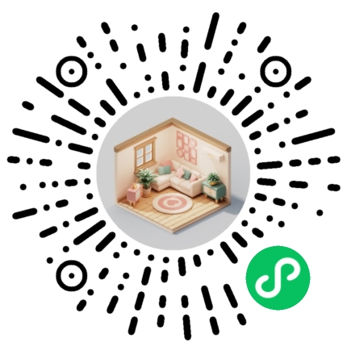

## 介绍

<demo-model url="/"></demo-model>

产品思维、UI设计、前端开发，TuniaoUI 小小团队，一直在追求这三者的平衡之道，也在追求 `酷炫创意`。五年开源时间，也被骂了五年。`谩骂`、`质疑`、`圈钱`、`抄袭` 声，每天都有，但努力做好图鸟就行吖，因为一个好心态，才能做出好的生态。感恩众多伯乐巨佬们的喜欢、信任与支持。
 

因为每天都被攻击，所以素材开启了防盗链，可以单独访问链接进行下载，或者下载图片素材资源，或者运行到微信小程序，勾选不校验域名。

### 免费内容-开源协议

TuniaoUI开源组件遵循[apache](https://baike.baidu.com/item/apache/6848636?fromModule=search-result_lemma)协议，开发者可以自由的享受和参与开源。

注意：这并不意味着您可以将TuniaoUI应用到非法的领域，比如涉及色情、赌博、暴力、诈骗等方面。如因此产生纠纷等法律问题，TuniaoUI不承担任何责任。

### 会员内容-会员协议

除了开源内容，本项目还扩展了会员专享内容，对于会员版的版权约束如下：

 `不能转售或将TuniaoUI源码（包含使用了TuniaoUI非开源代码）直接发布到公开渠道，圈子较小，请尊重版权。`

### 扫码预览 (  `已上线` 的小程序有以下) 
或前往：[`图鸟生态`](/theme/intro) 查看更多

 
<el-row>
    <el-col :xs="24" :sm="8" :md="8" :lg="8" :xl="6">
		

			<!--  -->
			
			

				图鸟UI H5
				
微信或浏览器扫码

			

		

	</el-col>
    <el-col :xs="24" :sm="8" :md="8" :lg="8" :xl="6">
		

			
			

				图鸟UI
				
酷炫创意UI框架

			

		

	</el-col>
    <el-col :xs="24" :sm="8" :md="8" :lg="8" :xl="6">
		

			
			

				图鸟Vue3
				
TS 组合式 api 框架

			

		

	</el-col>
    <el-col :xs="24" :sm="8" :md="8" :lg="8" :xl="6">
		

			
			

				圈子商圈
				
图鸟模板1

			

		

	</el-col>
    <el-col :xs="24" :sm="8" :md="8" :lg="8" :xl="6">
		

			
			

				社区博客
				
图鸟模板2

			

		

	</el-col>
    <el-col :xs="24" :sm="8" :md="8" :lg="8" :xl="6">
		

			
			

				凶姐壁纸
				
图鸟模板3

			

		

	</el-col>
    <el-col :xs="24" :sm="8" :md="8" :lg="8" :xl="6">
		

			
			

				资讯名片
				
图鸟模板4

			

		

	</el-col>
    <el-col :xs="24" :sm="8" :md="8" :lg="8" :xl="6">
		

			
			

				企业官网
				
图鸟模板5

			

		

	</el-col>
    <el-col :xs="24" :sm="8" :md="8" :lg="8" :xl="6">
		

			
			

				品牌商城
				
图鸟模板6

			

		

	</el-col>
    <el-col :xs="24" :sm="8" :md="8" :lg="8" :xl="6">
		

			
			

				办公OA
				
图鸟模板7

			

		

	</el-col>
    <el-col :xs="24" :sm="8" :md="8" :lg="8" :xl="6">
		

			
			

				盲盒藏品
				
图鸟模板8

			

		

    </el-col>
		<el-col :xs="24" :sm="8" :md="8" :lg="8" :xl="6">
		

			
			

				人脉交友
				
图鸟模板9

			

		

    </el-col>
		<el-col :xs="24" :sm="8" :md="8" :lg="8" :xl="6">
		

			
			

				猛犸空间
				
图鸟模板10

			

		

    </el-col>
    <el-col :xs="24" :sm="8" :md="8" :lg="8" :xl="6">
		

			
			

				教育学院
				
图鸟模板11

			

		

    </el-col>
    <el-col :xs="24" :sm="8" :md="8" :lg="8" :xl="6">
		

			
			

				花艺商城
				
图鸟模板12

			

		

    </el-col>
    <el-col :xs="24" :sm="8" :md="8" :lg="8" :xl="6">
		

			
			

				游戏社区
				
图鸟模板17

			

		

    </el-col>
		<el-col :xs="24" :sm="8" :md="8" :lg="8" :xl="6">
		

			
			

				拟态家居
				
图鸟模板18

			

		

    </el-col>
		<el-col :xs="24" :sm="8" :md="8" :lg="8" :xl="6">
		

			
			

				图鸟图表
				
酷炫图表模板 vue2

			

		

    </el-col>
    <el-col :xs="24" :sm="8" :md="8" :lg="8" :xl="6">
		

			
			

				图鸟图表 vue3
				
酷炫图表模板 vue3

			

		

    </el-col>
    <el-col :xs="24" :sm="8" :md="8" :lg="8" :xl="6">
		

			
			

				图鸟图表 原生
				
酷炫图表模板 原生

			

		

    </el-col>
		<el-col :xs="24" :sm="8" :md="8" :lg="8" :xl="6">
		

			
			

				图鸟生态
				
图鸟生态

			

		

    </el-col>
		<el-col :xs="24" :sm="8" :md="8" :lg="8" :xl="6">
		

			
			

				图鸟官网
				
图鸟会员官网-vue3

			

		

    </el-col>
		<el-col :xs="24" :sm="8" :md="8" :lg="8" :xl="6">
		

			
			

				图鸟vue3-支付宝
				
只能支付宝扫码

			

		

    </el-col>
</el-row>

