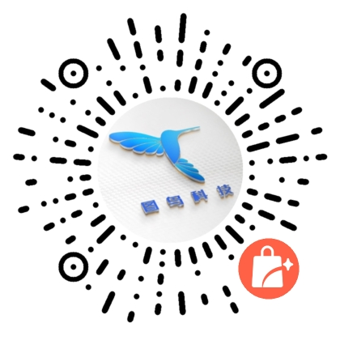

## 介绍

<demo-model url="/"></demo-model>

美观易用是TuniaoUI追求的。TuniaoUI现在已经发布了uni-app版本，后续会不断的拓展其他原生版本，扩大生态。

### 链接

- 更新日志：
- TuniaoUI介绍：
- uni-app Gitee地址:[https://gitee.com/TSpecific/tuniao-ui](https://gitee.com/TSpecific/tuniao-ui)

### 开源协议

TuniaoUI开源组件遵循[apache](https://baike.baidu.com/item/apache/6848636?fromModule=search-result_lemma)
协议，开发者可以自由的享受和参与开源。

注意：这并不意味着您可以将TuniaoUI应用到非法的领域，比如涉及赌博，暴力等方面。如因此产生纠纷等法律问题，TuniaoUI不承担任何责任。

### 会员内容

除了开源内容，本项目还扩展了会员专用内容，对于会员版的版权约束如下：

1. 不能转售或者将TuniaoUI源码（包含使用了TuniaoUI非开源代码）直接发布到公开渠道，违者必究！！！

### 线上程序扫码预览

<el-row>
    <el-col :xs="24" :sm="8" :md="8" :lg="8" :xl="6">
		

			
			

				TuniaoUI H5
				
微信或浏览器扫码

			

		

	</el-col>
    <el-col :xs="24" :sm="8" :md="8" :lg="8" :xl="6">
		

			
			

				图鸟UI
				
酷炫创意UI框架

			

		

	</el-col>
    <el-col :xs="24" :sm="8" :md="8" :lg="8" :xl="6">
		

			
			

				图鸟Vue3
				
酷炫创意UI框架

			

		

	</el-col>
    <el-col :xs="24" :sm="8" :md="8" :lg="8" :xl="6">
		

			
			

				圈子商圈
				
图鸟模板1

			

		

	</el-col>
    <el-col :xs="24" :sm="8" :md="8" :lg="8" :xl="6">
		

			
			

				社区博客
				
图鸟模板2

			

		

	</el-col>
    <el-col :xs="24" :sm="8" :md="8" :lg="8" :xl="6">
		

			
			

				凶姐壁纸
				
图鸟模板3

			

		

	</el-col>
    <el-col :xs="24" :sm="8" :md="8" :lg="8" :xl="6">
		

			
			

				资讯名片
				
图鸟模板4

			

		

	</el-col>
    <el-col :xs="24" :sm="8" :md="8" :lg="8" :xl="6">
		

			
			

				企业官网
				
图鸟官网

			

		

	</el-col>
    <el-col :xs="24" :sm="8" :md="8" :lg="8" :xl="6">
		

			
			

				品牌商城
				
图鸟模板6

			

		

	</el-col>
    <el-col :xs="24" :sm="8" :md="8" :lg="8" :xl="6">
		

			
			

				办公OA
				
图鸟模板7

			

		

	</el-col>
    <el-col :xs="24" :sm="8" :md="8" :lg="8" :xl="6">
		

			
			

				icon演示
				
微信或浏览器扫码

			

		

	</el-col>
    <el-col :xs="24" :sm="8" :md="8" :lg="8" :xl="6">
		

			
			

				小商店
				
只能微信扫码

			

		

	</el-col>
    <el-col :xs="24" :sm="8" :md="8" :lg="8" :xl="6">
		

			
			

				盲盒藏品
				
只能微信扫码

			

		

    </el-col>
    <el-col :xs="24" :sm="8" :md="8" :lg="8" :xl="6">
		

			
			

				图鸟图表
				
只能微信扫码

			

		

    </el-col>
    <el-col :xs="24" :sm="8" :md="8" :lg="8" :xl="6">
		

			
			

				图鸟vue3-支付宝
				
只能微信扫码

			

		

    </el-col>
    <el-col :xs="24" :sm="8" :md="8" :lg="8" :xl="6">
		

			
			

				人脉交友
				
只能微信扫码

			

		

    </el-col>
    <el-col :xs="24" :sm="8" :md="8" :lg="8" :xl="6">
		

			
			

				猛犸空间
				
只能微信扫码

			

		

    </el-col>
    <el-col :xs="24" :sm="8" :md="8" :lg="8" :xl="6">
		

			
			

				教育学院
				
只能微信扫码

			

		

    </el-col>
    <el-col :xs="24" :sm="8" :md="8" :lg="8" :xl="6">
		

			
			

				花艺商城
				
只能微信扫码

			

		

    </el-col>
    <el-col :xs="24" :sm="8" :md="8" :lg="8" :xl="6">
		

			
			

				图鸟官网-v3
				
只能微信扫码

			

		

    </el-col>
    <el-col :xs="24" :sm="8" :md="8" :lg="8" :xl="6">
		

			
			

				图鸟图表vue3
				
只能微信扫码

			

		

    </el-col>
    <el-col :xs="24" :sm="8" :md="8" :lg="8" :xl="6">
		

			
			

				图鸟图表原生
				
只能微信扫码

			

		

    </el-col>
</el-row>

