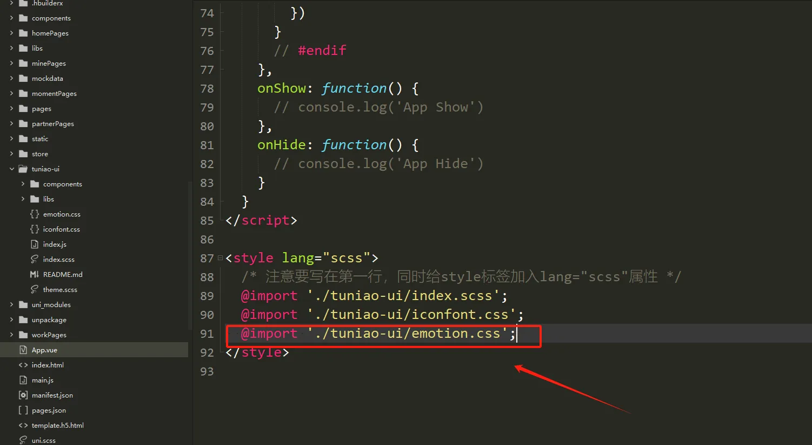

## CustomIcon 扩展自定义图标库

<!-- <demo-model url="/pages/componentsA/icon/index"></demo-model> -->

TuniaoUI 已通过大量的实践中，收集了用户最有可能需要用到的图标，见[Icon 图标](/components/icon.html)
，但我们也相信，它肯定无法覆盖所有的场景和需求。

用户也可以使用标签的方式，自行引入字体图标，为何要通过扩展的方式集成呢？  
这是因为TuniaoUI有统一的字体图标组件，使用方便，配置灵活，且风格统一。

:::tip 说明
以下说明和演示，均针对[阿里字体图标库](https://www.iconfont.cn)，其他字体库源同理
:::

[//]: # (总的来说，我们要实现的效果如下：)

### 图鸟 Iconfont 图标设计（iconfont官方偶尔换地址，只能从这里进入）：

[点我前往，不点算了](https://www.iconfont.cn/user/detail?spm=a313x.7781069.1998910419.d78986de3&uid=4252161&nid=PYMOSkuUR2ln)

### 如何使用一套字体图标或多套字体图标? 

 

##### 生成iconfont.css文件

1、找到自己喜欢的图标，并加入购物车（购物车图标）

    

2、点击右上角购物车，并“添加至项目”

    

3、如果没有项目，那就新建一个呗

    
    

4、项目设置

    

5、改一下引用前缀，勾选base64

    

6、下载

    

7、解压文件，找到有用的文件

    

##### 项目进行引用

1、把 iconfont.css 改下名字放到项目里面，例如这里改成了emotion.css

    

`注意，目前阿里改了规则，如果要拿到 //at.alicdn.com/t/c/font_xxx  的文件，需要点击下图这里去拿两个地址，直接下载的目前没有这两个地址了 `

    

2、复制全部，替换刚刚的emotion.css

    

3.app.vue全局引入

    

4、适当改造emotion.css的写法，方便调用，分别是改造前和改造后

    

    

5.css 里面进行引用的名称可以这里看

    

    

 
 
 

##### 最后提一下，为了多平台兼容性，应该仅把单色图标添加到阿里图标库的项目中，即使添加了多色的图标，在使用中，也会被转成单色。

    

 
 

##### 当然了，图鸟也推出了`图鸟双色字体图标`方案，使用方式和单色图标一样，文件大小也一样，数量也一样，详情可前往 图鸟模板市场。

    

