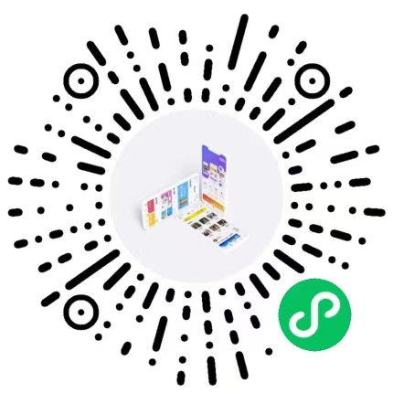

## 演示
Tuniao UI会将各个版本的演示在此展示，目前演示的版本有H5，微信小程序，其他版本的演示将会陆续添加。  
 

## 使用方法

- H5版本可以用微信或者手机浏览器扫描二维码即可
- 微信小程序只能通过微信扫码查看

 

## 说明

文档中也有相应的演示示例，但它是通过`iframe`嵌入到网页的，所以可能会造成某些uni-appAPI在网页上(
浏览器F12手机调试模式无问题)无法使用，造成组件有BUG的错觉。

**注意：** 建议您只在浏览文档时使用文档右侧的演示功能，电脑示例由于分辨率和uni-app用`rpx`
单位的问题，显示可能会不够细致，请通过微信扫码小程序体验最佳的效果。

 
 
 

## 扫码

    

		

			
			

				TuniaoUI H5
				
微信或浏览器扫码

			

		

	

    

		

			
			

				Tuniao圈子
				
只能微信扫码

			

		

	

    

		

			
			

				Tuniao Vue3
				
只能微信扫码

			

		

	

    

		

			
			

				Tuniao 商圈
				
只能微信扫码

			

		

	

    

		

			
			

				TuniaoUI
				
只能微信扫码

			

		

	

    

		

			
			

				Tuniao 壁纸
				
只能微信扫码

			

		

	

		

			
			

				Tuniao 奶茶
				
只能微信扫码

			

		

	

		

			
			

				Tuniao 官网
				
只能微信扫码

			

		

	

		

			
			

				Tuniao 小商店
				
只能微信扫码

			

		

	

